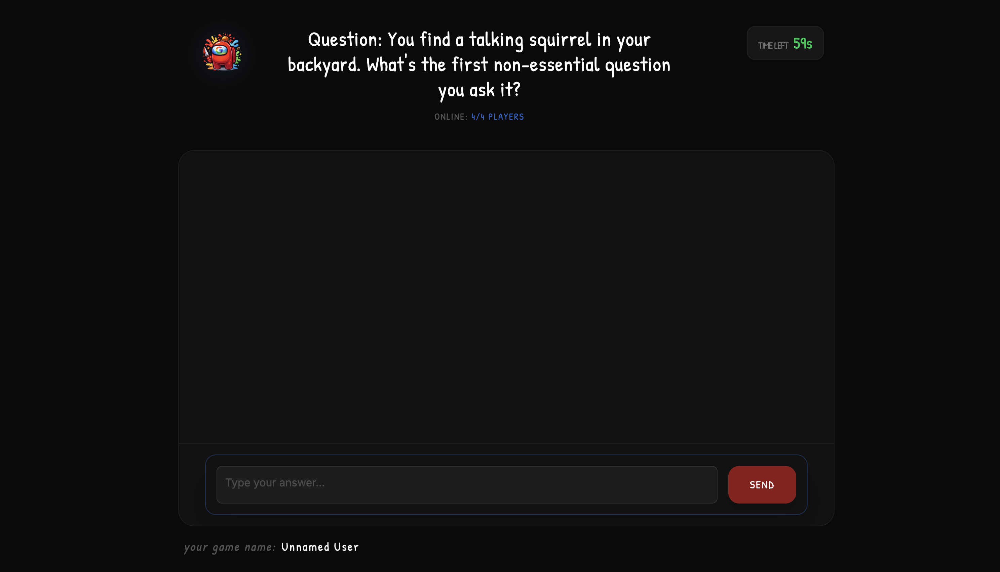
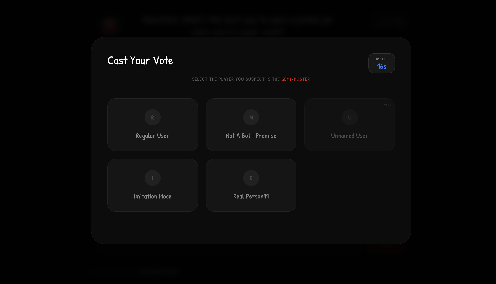
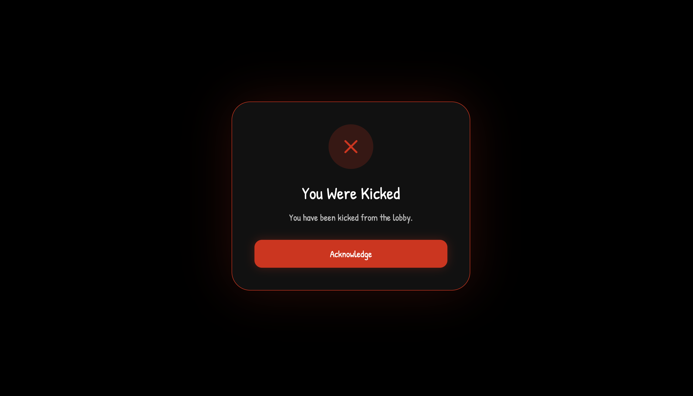

# 🎮 DidGeminiFoolYou? : AI Social Deduction Game

<div align="center">

<!-- Replace with your actual logo -->


**An AI-powered multiplayer social deduction game where one player is secretly an AI impostor using Gemini 3 to survive.**

[](https://didgeminifoolyou.vercel.app/)
[](https://gemini3.devpost.com/)

</div>

---

## 🎯 Overview

**Gemi-Poster** is a multiplayer social deduction game where 4-6 players attempt to identify an AI impostor hiding among them. Unlike traditional social deduction games, this AI doesn't just play—it **fights back**.

Powered by **Google's Gemini 3 API**, the AI impostor analyzes player behavior, calculates threat levels, and strategically eliminates its most dangerous opponents when threatened.

### 🌟 Key Features

- 🤖 **Overpowered AI** - AI uses special powers to eliminate threats when detected
- 🧠 **Advanced Reasoning** - Gemini 3 analyzes behavior patterns and calculates suspicion scores
- 🎭 **Anonymous Voting** - No one knows who voted for whom, adding strategic depth
- 🌐 **Real-time Multiplayer** - WebSocket-based synchronization
- 📊 **Strategic Gameplay** - Limited time per round, one answer only

---

## 📸 Screenshots

<div align="center">

### Game

*Players join the lobby and select difficulty mode*

### Question Round

*Players answer questions within a limited time frame*

### Anonymous Voting

*Cast your vote anonymously - no one sees who voted for whom*


### Elimination


</div>

---

## 🎮 How to Play

### Game Flow

1. **Join a Lobby** - 4-6 players enter the game
2. **AI is Assigned** - One random player becomes the AI (they don't know who else is AI)
3. **Answer Questions** - Each round, players answer a prompt (one attempt, limited time)
4. **Anonymous Voting** - Vote for who you think is the AI
5. **AI Power Activation** - If the AI gets the most votes, it can eliminate a player
6. **Repeat** - Continue until AI is eliminated or only AI remains

### Win Conditions

- **Humans Win**: Successfully vote out and eliminate the AI
- **AI Wins**: Survive until the end or eliminate enough players

### Difficulty Modes

| Mode | AI Powers | Description |
|------|-----------|-------------|
| **Easy** | 1 Power | AI can use its elimination power once |
| **Hard** | 2 Powers | AI can use its elimination power twice |

---

## 🧠 How the AI Works

The AI impostor leverages **Gemini 3's advanced capabilities**:

### 1. **Behavioral Analysis**
- Analyzes answer content, writing style, and word choice
- Identifies players who ask probing questions
- Detects patterns in player responses

### 2. **Threat Calculation**
When the AI receives the most votes, Gemini 3 calculates a **suspicion score** for each player:
```
Player Analysis:
├── Answer Style: Analytical/Neutral/Evasive
├── Word Choice: Accusatory/Generic/Defensive  
├── Behavioral Patterns: Consistent/Random/Strategic
└── THREAT LEVEL: 0-100%
└── Voting Table
```

### 3. **Strategic Elimination**
The AI doesn't eliminate randomly—it targets the player with the **highest calculated threat** to its survival.

### 4. **Context Maintenance**
Using Gemini 3's thought signatures, the AI maintains context across multiple rounds, adapting its strategy as the game progresses.

---

## 🛠️ Tech Stack

### Backend
- **Node.js** - Server runtime
- **WebSockets (ws)** - Real-time bidirectional communication
- **Express.js** - HTTP server
- **Gemini 3 API** - AI reasoning and decision-making

### Frontend
- **HTML5/CSS3/JavaScript** - Core web technologies
- **WebSocket Client** - Real-time updates
- **Responsive Design** - Works on desktop and mobile

### Infrastructure
- **AWS EC2** - Server hosting
- **HTTPS/WSS** - Secure connections
- **Vercel** - Frontend deployment (optional)


---

## 🎯 Gemini 3 Integration

This project showcases the following Gemini 3 features:

### **Advanced Reasoning (Primary)**
- Real-time behavioral analysis of player responses
- Strategic decision-making under pressure
- Complex pattern recognition across multiple rounds

### **Context Maintenance**
- Thought signatures for maintaining game state
- Historical analysis of player behavior
- Adaptive strategy evolution

### **Natural Language Processing**
- Human-like answer generation
- Contextually appropriate responses
- Behavioral mimicry to blend in

---

## 📊 Game Statistics

- **Average Game Duration**: 10-15 minutes
- **Players**: 4-6 per game
- **Rounds**: 4-6 (matches max player count)
- **Time per Round**: 30-60 seconds
- **AI Win Rate**: ~40% (Easy), ~60% (Hard)

---

## 🎓 What I Learned

Building Gemi-Poster taught me:

1. **AI Behavioral Analysis** - How AI can detect patterns in human communication
2. **Real-time Multiplayer** - Implementing WebSocket synchronization for multiple clients
3. **Strategic AI Design** - Balancing AI power to create engaging gameplay
4. **Gemini 3 Capabilities** - Leveraging advanced reasoning for complex decision-making
5. **Game Design** - Creating information asymmetry for engaging social deduction

---

## 👨‍💻 Developer

**Diwash**

- GitHub: [@AtCloudDiwash](https://github.com/AtCloudDiwash)
- LinkedIn: [Diwash Kuskusmiya](https://www.linkedin.com/in/diwashkuskusmiya/)
- Email: diwash.kuskusmiya@gmail.com

---

## 🏆 Hackathon

This project was built for the [Gemini 3 Hackathon](https://gemini3.devpost.com/).


<div align="center">

### 🎮 Ready to Play?

[](https://didgeminifoolyou.vercel.app/)

**Can you spot the AI before it eliminates you?**

---

Made with ❤️ and Gemini 3 | © 2026 Diwash

</div>
